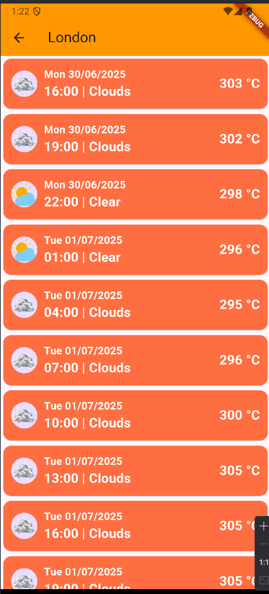

# 📱 Flutter Drawer Weather Quiz App

Ce dépôt contient une **application mobile Flutter** présentant un exemple simple de navigation par **Drawer** (menu latéral), combinée à deux fonctionnalités principales :  
un **quiz interactif** et une **affichage météo** dynamique.  
Cette application a été réalisée dans le cadre de l'apprentissage du **Développement Flutter** avec navigation et gestion d’état encadré par **Mr JAMAL MAWANE**.

---

## 🎯 Objectifs du projet

- 🧠 Créer une application multi-écrans avec navigation via Drawer
- 📋 Proposer un quiz simple pour tester l’utilisateur
- ☁️ Afficher la météo d’une ville donnée (ex: Londres)
- 🧩 Organiser proprement le code Flutter avec plusieurs fichiers

---

## 🧱 Structure du projet Flutter

lib/
├── main.dart           # Point d’entrée de l'application
├── quiz.dart           # Page du quiz
├── weather.dart        # Page météo (affiche la météo d'une ville donnée)
├── images/             # Contient les images utilisées dans l'application
│   └── profile.png     # Avatar de profil affiché dans le Drawer

## ▶️ Instructions d’exécution

1. **Cloner le projet** :
   ```bash
   git clone https://github.com/ouss-issib/drawer-weather-quiz.git
   cd drawer-weather-quiz

2. **Installer les dependences Flutter** :
   ```bash
   flutter pub get

3. **Lancer l'application** :
   - Ouvrir dans Android Studio ou VS Code
   - Lancer un émulateur ou brancher un smartphone Android
   - Appuyer sur Run ou exécuter :
   ```bash
   flutter run

  ## 📸 Captures d’écran

| Drawer | Quiz Question 1 | Quiz Question 2 | Score |
|---|---|---|---|
|  |  |  |  |

| Weather for London| 
|---|
|  |
